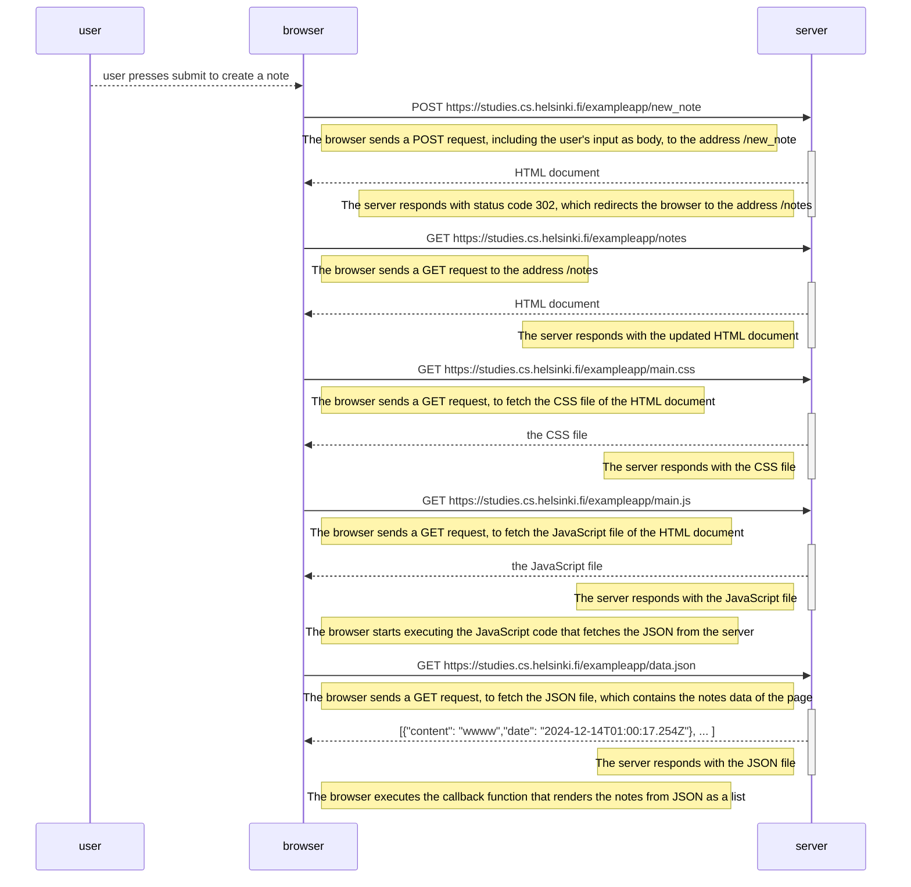

```mermaid
sequenceDiagram
    participant user
    participant browser
    participant server
    user-->>browser: user presses submit to create a note
    browser->>server: POST https://studies.cs.helsinki.fi/exampleapp/new_note
    Note right of browser: The browser sends a POST request, including the user's input as body, to the address /new_note
    activate server
    server-->>browser: HTML document
    Note left of server: The server responds with status code 302, which redirects the browser to the address /notes
    deactivate server
    browser->>server: GET https://studies.cs.helsinki.fi/exampleapp/notes
    Note right of browser: The browser sends a GET request to the address /notes
    activate server
    server-->>browser: HTML document
    Note left of server: The server responds with the updated HTML document
    deactivate server
    browser->>server: GET https://studies.cs.helsinki.fi/exampleapp/main.css
    Note right of browser: The browser sends a GET request, to fetch the CSS file of the HTML document
    activate server
    server-->>browser: the CSS file
    Note left of server: The server responds with the CSS file
    deactivate server
    browser->>server: GET https://studies.cs.helsinki.fi/exampleapp/main.js
    Note right of browser: The browser sends a GET request, to fetch the JavaScript file of the HTML document
    activate server
    server-->>browser: the JavaScript file
    Note left of server: The server responds with the JavaScript file
    deactivate server
    Note right of browser: The browser starts executing the JavaScript code that fetches the JSON from the server
    browser->>server: GET https://studies.cs.helsinki.fi/exampleapp/data.json
    Note right of browser: The browser sends a GET request, to fetch the JSON file, which contains the notes data of the page
    activate server
    server-->>browser: [{"content": "wwww","date": "2024-12-14T01:00:17.254Z"}, ... ]
    Note left of server: The server responds with the JSON file
    deactivate server
    Note right of browser: The browser executes the callback function that renders the notes from JSON as a list
```