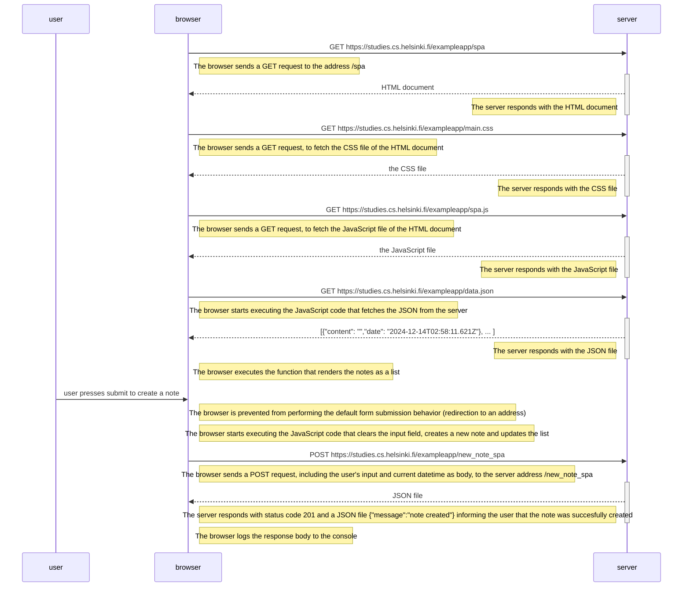

```mermaid
sequenceDiagram
    participant user
    participant browser
    participant server
    browser->>server: GET https://studies.cs.helsinki.fi/exampleapp/spa
    Note right of browser: The browser sends a GET request to the address /spa
    activate server
    server-->>browser: HTML document
    Note left of server: The server responds with the HTML document
    deactivate server
    browser->>server: GET https://studies.cs.helsinki.fi/exampleapp/main.css
    Note right of browser: The browser sends a GET request, to fetch the CSS file of the HTML document
    activate server
    server-->>browser: the CSS file
    Note left of server: The server responds with the CSS file
    deactivate server
    browser->>server: GET https://studies.cs.helsinki.fi/exampleapp/spa.js
    Note right of browser: The browser sends a GET request, to fetch the JavaScript file of the HTML document
    activate server
    server-->>browser: the JavaScript file
    Note left of server: The server responds with the JavaScript file
    deactivate server
    browser->>server: GET https://studies.cs.helsinki.fi/exampleapp/data.json
    Note right of browser: The browser starts executing the JavaScript code that fetches the JSON from the server
    activate server
    server-->>browser: [{"content": "","date": "2024-12-14T02:58:11.621Z"}, ... ]
    Note left of server: The server responds with the JSON file
    deactivate server
    Note right of browser: The browser executes the function that renders the notes as a list
    user->>browser: user presses submit to create a note
    Note right of browser: The browser is prevented from performing the default form submission behavior (redirection to an address)
    Note right of browser: The browser starts executing the JavaScript code that clears the input field, creates a new note and updates the list
    browser->>server: POST https://studies.cs.helsinki.fi/exampleapp/new_note_spa
    Note right of browser: The browser sends a POST request, including the user's input and current datetime as body, to the server address /new_note_spa
    activate server
    server-->>browser: JSON file
    Note left of server: The server responds with status code 201 and a JSON file {"message":"note created"} informing the user that the note was succesfully created
    deactivate server
    Note right of browser: The browser logs the response body to the console
```